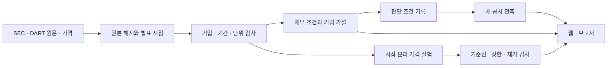

# 독립 미국·한국 주식 리서치 시스템

셀트리온에는 세 사업부의 내부매출·이익 조정과 연간·반기 현금 부호를 대사한 현금 작업표를 추가했습니다. 영업현금 밖의 이자 지급·수취, 공급자금융 순변동, 개발비의 임상 단계별 총장부·손상·순장부를 구분합니다. 개발비 증가를 현금 취득이나 신약 성공 확률로 바꾸지 않고, JNJ와의 비교에서도 제품별 경쟁과 현금 범위를 따로 검토합니다. 통합 검증의 완료 여부는 아래 실행 기록의 현재 해시로 확인합니다.

네이버의 관계·공동기업 투자 장부금액과 변동을 원문에 대사하고 사업 현금과 분리했습니다. 별도 투자 가치는 처음에 미평가로 남으며, 세금·비지배 귀속·처분비·시점을 검토한 순현재가치를 입력하면 잔여 시가총액의 말기 현금·사업 마진을 다시 계산합니다. 빈칸과 명시적 0을 구분하고 기업·비교 작업에서 저장·복원합니다. 장부금액을 자동으로 더하거나 이 부분 소계를 전체 적정가치로 표시하지 않습니다.

각 기업 현금 작업표는 다른 선택 가정을 고정한 채 한 사업부의 5년차 마진만 역산해 현재 가격과 대조합니다. 세금과 중간 연도·말기 현금을 다시 계산하며, 결과를 한 행씩 가정에 대입하고 저장·복원합니다. 탐색 범위 밖은 수치를 외삽하지 않고, 증권 권리가 미확정이면 역산을 보류합니다. 여러 사업부의 개별 역산값을 동시에 적용하거나 이를 정상 마진 전망으로 표시하지 않습니다.

JNJ는 보고 부문 세전이익에서 미배분 소송·이자·본사 비용을 차감하는 별도 경로입니다. 추가 이자를 중복 차감하지 않고, 상각을 되돌리는 경우 설비·인수·취득 연구개발·기타 투자 현금도 함께 가정합니다. 세율25%·미래 금융리스0은 연구 가정이며 실제 정상 비용으로 승인한 값이 아닙니다. 셀트리온과의 비교에서 이익 기준·기간·통화 차이를 유지합니다.

로컬 진입점은 [local.html](local.html)입니다. 서버 없이 이 파일을 열거나 `python3 start.py open`을 실행합니다. `python3 start.py status`는 현재 분석과 마지막 검증 버전·실패 단계를 구분합니다. 저장 자료 재계산은 `python3 start.py offline`, 공개자료와 상세 원문 수집은 `python3 start.py collect`, 로컬 판독·평가·출력은 `python3 start.py research`입니다. 모델은 프로젝트 `.local/models`에만 둡니다.

현재 조사 대상은 60개이며 본문 공시를 모두 로컬에 보존했습니다. 기업 화면의 **연구 작업 열기**에서 원문을 검색하고 근거를 채택한 뒤, 판단·비교·가격 가정·반론·변경 조건을 기록할 수 있습니다. 작성 중 초안과 버전 이력은 브라우저에 저장합니다. 이동·백업은 **전체 연구 기록 내보내기**를 사용합니다.

60개 기업에는 현재 공시 문단을 읽는 별도 로컬 판독을 연결했습니다. **사업 설명을 읽은 로컬 초안**에서 원문과 생성문을 대조하고 개인 연구로 가져올 수 있습니다. 본문 판독 v3는 60개를 생성했고 문장별 원문 대조 기록을 보존했습니다. 수정이 필요한 문장과 원래 응답을 함께 보여주며 큰 충돌을 찾지 못한 기록도 금융 승인이 아닙니다. KT 표제·단위를 보강하고 재판독한 결과까지 포함해 55개는 수정 필요, 5개는 큰 사실 충돌 미발견입니다. 현재 입력과 일치하는 기록만 화면에 연결합니다. 문장별 지적과 원 응답을 함께 보존하며, 모델이 만든 조건은 사전 등록된 판단 원장에 자동으로 넣지 않습니다. 직접 실행은 `python3 scripts/local-filings.py --resume --wait-gpu-seconds 3600`입니다.

기업별 공시를 대조해 작성한 사업 해석은 60개입니다. 제품·사업부의 성장, 비용과 일회성 요인, 가격 가정, 반론과 변경 조건을 문단 ID에 연결합니다. 예를 들어 AMD의 수출통제 비용 기저효과, Broadcom의 계약 해지 조항에 따른 매출 인식, Apple의 관세 환급과 메모리 비용을 구분합니다. Intel의 파운드리 적자 변화와 Qualcomm의 제품별·자동차 매출 변화를 원문 금액으로 분해한 그래프도 제공합니다. 반올림 잔차와 분기·누적기간을 구분합니다. 작성자 연구 초안이며 독립 금융 승인은 아닙니다.

양쪽 공시를 연결한 비교 연구는 21쌍입니다. 클라우드 계약·회수, 광고와 커머스 구성, 자동차의 물량·가격·이익률, 완제품과 반도체, 신약과 바이오시밀러, 항공 엔진과 복합 방산, 배터리 모회사·자회사, 반도체 장비·서비스를 비교합니다. 공시가 바뀐 쌍은 이전 해석을 그대로 이어 쓰지 않습니다.

JNJ·셀트리온 비교에는 제품별 매출과 대응 제품, JNJ 부문 세전이익·미배분 비용 및 순이익·영업현금 변화의 별도 대사 차트를 추가했습니다. 제품·지역 합계의 반올림 차이와 동일 범위의 셀트리온 매출 미확인을 보존합니다. 취득 연구개발 현금·기업 인수·기타 투자는 장부 증가와 분리하고, 소송 충당금 현재가치를 최대 손실로 쓰지 않습니다.

Broadcom·Lam Research·Applied Materials·현대모비스·네이버·셀트리온·JNJ·삼성SDS·ServiceNow·Qualcomm·Netflix·Oracle·LG이노텍·Adobe·Salesforce·Texas Instruments·Analog Devices까지 기업별 현금 모델은 31개입니다. 고객 리스 보증의 시점별 일회성 순지급, 보증 순발생·정산, 재분류 전후 사업부 수치를 각 회사의 원문에 연결합니다. 계산과 수치 대사는 정상 이익이나 투자 선호의 승인과 구분합니다.

**기업 비교 작업**에서 Tesla·기아와 Microsoft·Amazon의 성장·마진·재투자 가정을 함께 편집합니다. 선택 현금 경로와 각 회사의 관측 가격이 요구하는 현금을 비교하고, 판단·반론·변경 조건을 양쪽 공시·가격·가정과 함께 저장합니다. 기록은 JSON으로 내보내고 복원하며, 근거가 바뀐 기록은 과거 이력으로 보존합니다. 인쇄에는 선택한 사업 가정과 작성한 판단을 고정합니다. Alphabet·Meta의 광고·AI 투자와 Micron·SK하이닉스의 메모리 사업, NVIDIA·AMD의 AI 가속기 계약과 Apple·삼성전자, NVIDIA·Broadcom의 고객 금융, Applied Materials·Lam Research의 장비·서비스와 기아·현대모비스의 자동차 가치사슬, Alphabet·NAVER의 플랫폼, JNJ·셀트리온의 의약품과 ServiceNow·삼성SDS의 기업용 서비스와 Oracle·삼성SDS의 인프라 소유·운영, Salesforce·Adobe의 소프트웨어 계약과 Texas Instruments·Analog Devices의 아날로그 제조까지 15쌍을 연결했습니다. SK하이닉스의 최근 자기주식 취득 수량은 미확인으로 주당 계산을 보류합니다. 나머지 6쌍은 현재 원문 비교를 제공합니다.

삼성SDS 전환사채와 Intel 정부 워런트·에스크로 주식은 실제 유통 수량과 구분한 계약표를 제공합니다. 전환·상환·후속 해제 조건이 남아 두 기업의 주당 계산은 보류합니다.

사업부 분석은 14개, 현금·채권 상세는 2개입니다. 주당 가격 시나리오는 증권·사업 범위를 확인한 기업에 연결했고, 나머지는 증권 권리·금융 자회사·수량 충돌·사업 분리 전후 현금 범위를 보완해야 합니다. Micron·SK하이닉스에는 공시의 가격·출하 설명과 배당 포함 여부의 현금 민감도를 연결했습니다. 중단영업 또는 금융부문 때문에 보류된 기업 현금은 계속영업 매출·투자와 대사하기 전 가격 역산과 현금 우열을 보류합니다. 이 상태는 전체 분석 목표의 완료가 아닙니다.

Microsoft에는 세 사업부의 매출 성장·이익률을 세금·감가상각·영업자산과 부채·설비투자·리스 부담으로 연결하는 현금 경로 작업표를 추가했습니다. 미래에 유지할 가정을 수정·저장하고 원문 및 정확한 가정 JSON을 연구 노트에 채택합니다. 원문 영업현금 대사와 미래 정상화 가정을 구분하며 초과 현금·투자자산 배분을 포함한 완전한 증권 가치평가는 남아 있습니다.

Amazon에도 북미·국제·AWS의 최근 1년 매출과 이익을 바탕으로 별도 현금 경로를 연결했습니다. 설비 상각만 되돌리고 콘텐츠·영업리스 비용은 남깁니다. 설비 매각·인센티브, 금융리스와 시설금융 상환을 구분하며, 원문이 직접 공시한 최근 1년 영업현금과도 교차 확인합니다. 현재 투입 비율 유지 가정은 음수 현금이므로 주당 가치를 계산 보류하고 투자 회수 가정을 편집합니다. 정상화·투자 판단의 승인은 아닙니다.

Amazon의 에너지 평가손익은 연간·전년 반기의 금액 미공시와 당기 반기의 5억 9,900만 달러를 구분합니다. **확인된 반기 이익만 제외**로 미래 연결 영업이익과 선택 세율에 따른 현금을 조정합니다. 전체 최근 1년 정상화나 AWS 전액 귀속을 가정하지 않으며, 원래 영업현금 대사는 유지합니다. 같은 제외 비율을 기업 비교 작업과 저장·복원에도 연결했습니다.

기아에는 연결 단일 사업과 판매보증충당부채를 연결한 세 번째 현금 모델을 추가했습니다. 연간·당기 반기·전년 반기의 충당부채 잔액과 증가·사용·기타 변동을 각각 대사하고, 보증비용·현금표 조정의 차이를 남깁니다. 유형·무형 취득과 리스 원금을 차감하고 보증 사용 부담을 편집합니다. 보증 사용 비율 +1%p·영업자금 소요 0의 결합 스트레스를 비교할 수 있습니다. 연구 노트를 내보내고 가져온 뒤 같은 공시·계산 버전의 정확한 사업 가정을 복원할 수 있습니다.

Apple·Micron·SK하이닉스·NVIDIA·AMD·삼성전자까지 기업별 사업 현금 모델은 12개입니다. AMD의 ZT 제조사업 현금을 분리하고 고객 구매 연동 워런트를 추가해 주당 계산을 보류합니다. 미국 공시의 회사별 확장 태그를 보강하면서 GE의 중단영업 현금도 확인했습니다. Alphabet은 Other Bets 손실·본사 공통비·매출 헤지와 리스 선급금을 구분하며 권리 배분 전 주당 값은 보류합니다. Meta는 두 사업부 손익·법인세 구제·설비와 리스 현금을 대사하고, 법정세율21%를 명시적 연구 가정으로 사용합니다. A·B주의 동일 배당·청산권과 같은 날짜의 유통 수량을 확인해 합산 주당 현금을 A주 가격과 비교합니다. 의결권·두 종류의 시장가격이 같다는 평가가 아닙니다.

미국 7개(Micron·NVIDIA·Alphabet·Apple·Amazon·AMD·Broadcom)의 사업부 매출과 이익을 직전 연간 + 당기 누적 − 전년 누적으로 연결했습니다. 양쪽 공시의 부문 정의와 조정 항목을 고정하고 새 공시에는 재검토를 요구합니다. Broadcom의 연결 이익 차이는 공시 비용 네 항목으로 대사했습니다. 한국 6개도 양쪽 연결 주석을 대조해 같은 기간으로 연결했습니다. LG전자·현대차·삼성바이오로직스는 대사됐고, 삼성전자·셀트리온·HD현대중공업의 잔차는 원 단위 및 세 공시 기간별로 남깁니다. HD현대의 합병 전후 범위를 표시하며, 손익의 기간 연결로 중단영업 현금의 보류를 해제하지 않습니다.

공시와 가격에서 기업의 가설을 만들고, 선별 규칙과 위험 정보를 기준선으로 검증하며, 판단 변경 조건을 다음 관측까지 추적한다. 보고서는 이 연구 과정의 출력이다. report·prelude·xsec·졸업논문의 방법과 근거를 참고하지만 자체 코드·자료 사본·계산·실험·이력을 사용한다.

현재 실제 자료를 사용하는 독립 배치 연구 엔진과 로컬 정적 화면이 동작한다. 조사 대상은 **미국 30개·한국 30개, 총 60개**이며 반도체·플랫폼·전자·소프트웨어·콘텐츠·유통·통신·게임·소비재·자동차·산업재·헬스케어·배터리/소재를 포함한다. SEC·DART 기업 목록에서 식별자를 확인한 수동 선정 표본이다. 기준일은 **2026-09-29**이며 전체 시장의 추천 순위가 아니다. 기업별 가격 적정성과 선별 규칙 자체의 표본외 초과수익 검증은 아직 남아 있다.

검증은 `python3 scripts/run-local.py --skip-model --as-of 2026-09-29`로 수행합니다. 현재 실행 증거와 실패 단계는 [마지막 검증 실행](artifacts/local/last-verified-run.json), [산출물 검사](artifacts/live/artifact-verification.json)에 있습니다. 실행 기록의 snapshotHash와 현재 분석 버전이 다르면 이전 검증이며 새 변경의 통과 근거로 재사용하지 않습니다.

2026-10-06 검증한 분석 버전은 `210f084d8cf2`입니다([실행 기록](artifacts/local/runs/20261006T022515928961Z/run.json)). 479개 단위 검사, 원문 400개·분석 12필드 오프라인 재현, Chrome 532개 검사와 PDF 55개·754쪽 검사를 통과했고 조사 질문 선택은 60/60입니다. 기업 전체 자유 생성 판독은 의미 품질 기준에 여전히 미달이라 해당 초안은 보류 상태입니다. 같은 날 새 가상환경에 오프라인 wheel 16개(`lxml` 추가)만 설치하고 네트워크 없이 479개 단위 검사와 재현도 통과했습니다. 2026-10-01 `ff9b35258f76`(227개 단위 검사·PDF 24개)과 [그 시각 점검](artifacts/live/visual-verification-ff9b35258f76.json)은 이전 버전 기록입니다. GPU 실행은 Qwen3:8B와 실제 기업 입력으로 확인했으며, 이 검사는 생성된 금융 해석의 승인을 뜻하지 않습니다.

## 로컬 연구 환경 — 최신 운영 방향

외부 AI API 없이 로컬 모델로 기업 근거와 반론을 검토한다. 공개 공시·가격만 인터넷에서 수집하며 추론·기록·화면은 로컬에 둔다. 저장 자료로 오프라인 재분석할 수 있다. 기존 공개 Pages는 이전 배포본이고 새 내부 분석을 자동 배포하지 않는다.

```sh
python3 scripts/local-research.py --recalculate --evaluate --model qwen3:8b --thinking
```

[로컬 화면](app/index.html) · [실행·GPU·검증 안내](docs/local-runtime.md)

저장 자료의 계산부터 화면·PDF 검사까지 한 번에 실행하려면 `python3 scripts/run-local.py --evaluate`를 사용한다. 같은 모델 설정의 다음 실행에서는 `--evaluate`를 생략한다. GPU를 쓰지 않고 계산·출력만 다시 만들 때는 `python3 scripts/run-local.py --skip-model`을 사용한다. 단계별 로그와 실패, 마지막 검증 실행을 `artifacts/local/runs/`와 `artifacts/local/last-verified-run.json`에 남긴다. 이 실행은 원격 발행을 하지 않는다.

채권 심층 분석은 순매출채권의 기초·기말, 총액과 충당금, 평균·기말 잔액의 매출 대비 대용일수, 현금흐름 조정액과의 차이를 보여준다. 각 숫자에 원 공시·보존 사본·접수번호를 연결했다. Micron 경영진의 설명과 SK하이닉스의 채권 양도·신용관리 정책은 독립적인 회수 실적 증거와 구분한다. 두 시점 평균과 총매출로 만든 대용일수를 실제 회수일수로 표시하지 않는다.

내부 원장은 60개 기업의 현금 마진 조건과 두 기업의 채권 부담 조건 2개, 기존 Ford 1분기 조건을 포함해 총 63개를 추적한다. 새 조건은 다음 공시 대기 상태다. 사전 방향 예측을 등록하지 않았으므로 조건 성립 여부와 예측 적중률을 혼동하지 않는다. 통합 실행은 같은 기간의 조건을 중복 등록하거나 기존 기준선을 갱신하지 않는다.

현금흐름 분해, 전년 변화, 미국·한국 메모리 기업 비교, 주식가치가 요구하는 현금의 조건부 역산을 추가했다. 매출·채권 현금 효과·영업현금은 코드가 계산하고, 로컬 모델은 가능한 설명·경쟁하는 설명·다음 구별 관측·근거 공백을 작성한다. 문장마다 별도 반론 호출을 수행하며, 명시적 유보 표현이 없는 가설은 보류한다. 모델 단독 오류와 형식 조건을 포함한 오류를 개발 평가에서 각각 기록한다. 자체 검토 초안이며 금융 해석의 독립 승인으로 표시하지 않는다. 현재 Micron·SK하이닉스의 자동 해석은 둘 다 수정 필요 상태다. 관측과 가격 가정은 조회할 수 있고, 보류된 문장과 반론은 펼쳐서 확인한다.

기업 전체 자유 생성 판독은 원문 입력·모델 설정·문장별 비판·수정 전후를 보존합니다. 현행 Qwen3:8B v12의 개발 12문장에서는 오류 허용 0/6·적절한 문장 거부 0/6, 별도 공시·합성 24문장에서는 결합 판정 오류 허용 0/12·거부 1/12였습니다. 별도 평가의 모델 단독 오류 허용은 1/12입니다. 작성자 평가이며 독립 금융 해석 정확도가 아닙니다. 실제 60개의 자체 판정은 최신 원 기록에 보존합니다. 추가 문장 대조까지 포함하면 현재 58개가 채택 보류이며 검토용으로 펼치는 것은 2개입니다. 이 수량은 금융 해석의 승인 수가 아닙니다. 실제 기업에서 추가로 발견한 인과·회계 오류는 `model-note-holds.jsonl`에 원문·기록 해시·이유·검토자를 남겨 채택 보류합니다. 14B와 다른 모델의 시험 기록도 보존했으며, 개선이 입증되지 않아 기본 모델을 바꾸지 않았습니다.

실제 연구 흐름에는 별도의 **조사 질문 선택**을 연결합니다. 로컬 모델은 기업 관측·사업부·가격 조건·동종 차이를 읽고 적용 가능한 연구 설계 두 가지를 고릅니다. 설계의 경쟁 설명·추가 자료·구별 관측은 명시적으로 작성한 문구입니다. 모델이 자유롭게 회사 원인을 지어내거나 수치를 다시 쓰지 않습니다. `python3 scripts/local-questions.py --resume --wait-gpu-seconds 3600`으로 실행하고, 입력·선택·원응답·GPU·모델 해시를 보존합니다. 기존 자유 생성의 문장 평가를 질문 선택의 효과 검증으로 재사용하지 않습니다.

## 60종목 분석 범위

모든 기업에 최신 확보 공시와 가격, 전년 대비 영업이익의 매출·마진 항등식 분해, 영업현금·투자지출 변화, 최대 6개 연간/12개월 구간, 조사 분류별 질문, 선택 가능한 기업 간 비교를 연결했다. 항목이 없으면 분해를 보류한다. 기업명·종목코드 검색, 시장·사업 분류 필터를 함께 사용할 수 있다. 비교에서는 누적기간·종료일·회계기준·투자 범위 차이를 표시한다.

- **공통 계산 60개:** 연간 이력 확보 60개. 원문 항목이 갖춰진 기업만 이익 변화를 분해합니다. 연간/12개월 구간은 서로 겹칠 수 있으며 과거 시점에 사용 가능한 신호와 다르다.
- **상세 분석:** Micron·SK하이닉스 현금·채권 2개와 Micron·Microsoft·현대차·NVIDIA·Apple·Alphabet·삼성전자·LG전자·Amazon·AMD·Broadcom·삼성바이오로직스·셀트리온·HD현대중공업의 사업부 14개. 내부거래·본사 비용·합계 잔차를 각각 남기며 미연결 차이의 원인을 만들지 않는다.
- **기업 전체 로컬 판독:** 60개 공시 입력에 별도 가설·반론 절차를 제공한다. 실행 수·실패·개발 평가 상태는 `data/coverage-reviews/`와 기업 화면에서 확인한다. 채권 판독과 평가 기록을 혼합하지 않는다.
- **연구 실험 8개:** 기존 개발 표본을 고정했다. 60종목 확장에 맞춰 과거 성과를 다시 골라 제시하지 않는다.
- **원문 보완:** Ford 2분기는 SEC 원문 XBRL과 공식 제출 목록을 대조해 companyfacts의 누락을 보충했다. Lilly 투자지출은 실제 현금흐름표 표제·금액·기간을 확인했다. 한화는 첨부 영업보고서 정정과 원 사업보고서 재무제표를 구분해 연간 이력을 연결했다. 이전 수집 실패도 남긴다.
- **조건부 연구 의견:** 전 기업의 관측·가설 변경 조건·가격 요건·고정된 조건 이력을 한 화면에서 연결한다. 정상 배분 현금·비교군 가치가 검증되지 않은 기업은 관찰 또는 자료 확인으로 남으며 자동 선호를 만들지 않는다.
- **새 전향 관측:** `register-study`는 최초40개 대상·선택·기준선을 유지한다. 현재60개로 자동 확대하지 않는다. 등록 후 21·63거래일 결과를 비용 가정, 성장 조건 제거, 모멘텀, 완전예지 상한과 함께 관측한다. 실제 미래 가격 전에는 대기이며 한 구간만으로 알파를 판정하지 않는다.

초기 확대 수집은 다음 명령으로 재개할 수 있다. 기존 보존 자료는 재사용하고 누락을 보충한다. 최신 전체 자료의 갱신에는 아래 `refresh --online`을 사용한다.

```sh
python3 scripts/expand-coverage.py --dart-env /권한있는/키파일 --reuse-identities
```

`coverage-identities.json`은 기업 목록 원본 해시·검증시점, `coverage-retrieval.json`은 기업별 수집 상태와 과거 공시 연결 실패를 보존한다. 키는 DART 공개자료 요청에만 사용한다.

## 이전 GitHub 공개판

이전에는 GitHub 전용 배포를 요청했다. 이후 사용자가 로컬/내부망 추론으로 운영 방향을 변경했으므로 아래는 기존 공개판의 기록이다. 공개 저장소는 [soccz/equity-research](https://github.com/soccz/equity-research), 화면은 **https://soccz.github.io/equity-research/** 이다. 기존 홈페이지의 Project 항목에서도 연결된다. `.github/workflows/research-pages.yml`은 GitHub가 제공하는 `ubuntu-24.04`에서 계산·검증·발행한다. 기존 로컬 서버는 종료했고, 서버 코드·API 호출·화면의 로컬 갱신 버튼을 제거했다.

[최신 공개본 사본](deploy/repository/site/app/index.html) · [로컬 검증본](site/app/index.html) · [배포 준비 압축파일](deploy/equity-research-ready.zip) · [GitHub 운영 안내](deploy/README.github.md)

`site/`는 HTML·JavaScript·그림·PDF만 포함한다. 필터·기업 시나리오·과거 판단 조회는 브라우저 안에서 동작한다. 새 계산은 GitHub Actions의 수동 실행으로 요청하며, 화면은 검증한 결과를 읽는다. [2026-09-30 전체 hosted 실행](https://github.com/soccz/equity-research/actions/runs/36682085869)이 수집부터 배포까지 통과했다. 예약 실행은 설정하지 않았다.

| 화면 | 실제 동작 |
| --- | --- |
| 종목 탐색 | 미국·한국 필터, 재무 조건별 조사 후보, 지표별 정렬, 투자 부담과 현금 마진 산점도 |
| 기업과 가설 | 원 공시와 계산, 현금 비교, 반론, 기업별 시나리오, 가격 경로와 위험 |
| 실험과 기준선 | 가격 규칙·과거 공시 선별 규칙의 별도 평가, 기준선·완전예지 상한·QLIKE·제거 실험, 판단일별 원문 확인 |
| 판단 이력 | 실제 기업 조건 8개 보존, 후속 공시 판정, 변경 탐지, 최초 관측 보존 |
| 자료와 검증 | 기업·기간·회계·단위·발표 시점, 원문 링크와 자체 사본, 실패 상태 |

[Micron 보고서](artifacts/live/micron.pdf) · [SK하이닉스 보고서](artifacts/live/sk-hynix.pdf) · [Microsoft 보고서](artifacts/live/microsoft.pdf) · [Amazon 보고서](artifacts/live/amazon.pdf) · [기아 보고서](artifacts/live/kia.pdf) · [Tesla 보고서](artifacts/live/tesla.pdf) · [현대자동차 보고서](artifacts/live/hyundai.pdf) · [미국 연구](artifacts/live/research-us.pdf) · [한국 연구](artifacts/live/research-kr.pdf) · [비교 보고서](artifacts/live/universe.pdf) · [조건 기록](artifacts/live/conditions.pdf)

## 자료에서 연구까지



미국 공시는 SEC companyfacts, 한국은 OpenDART의 접수 목록과 XBRL API로 직접 수집한다. 초기 보존 원본 4건에 과거 공시·정정 공시 25건을 추가했다. 기존 report 엔진이나 해석을 호출하지 않는다. 미국·한국 가격은 Yahoo Finance의 현재 조정 시계열을 보존한다. 공시 발표일, 기간, 연결 범위, 통화, 종목 식별자를 함께 검사한다.

투자 항목은 유형자산 취득, 유형·무형 통합 취득, 기타 분류 유형자산 취득으로 나뉜다. 기업·기간마다 사용한 원 태그와 범위를 표시하며 전년과 분류가 달라지면 현금 마진 변화 비교를 보류한다. 영업현금에서 이 항목을 뺀 값은 FCFF나 회사 발표 조정 FCF가 아니다. 누적 현금흐름의 분모에 분기 매출을 섞지 않는다. 미국과 한국의 회계기간·사업 구성 차이도 화면에 표시한다.

## 갱신과 재생성

Python 3.11 이상, NumPy·Matplotlib, Noto CJK 글꼴이 필요하다. 검증한 패키지 버전은 [requirements.txt](requirements.txt)에 고정했다. 브라우저용 npm 패키지는 없다.

```sh
# SEC·DART·양국 가격 갱신. 키가 없으면 저장본으로 대체하지 않고 중단
python3 -m equitylab refresh --as-of 2026-09-29 --online --dart-env /권한있는/키파일

# 한국의 과거 정기공시와 정정 원문 확보
python3 -m equitylab sync-history --as-of 2026-09-29

# 보존 원문과 가격만으로 오프라인 재계산
python3 -m equitylab refresh --as-of 2026-09-29

# 현재 조건 등록 / 이후 새 공시 판정
python3 -m equitylab register
python3 -m equitylab observe
```

실패한 실행도 `data/runs/`에 남기되 기존 완료본을 대체하지 않는다. 완료본은 원문 참조·수치·실험 설정·계산 코드와 화면 코드의 사본 및 해시를 보존한다. `data/latest.json`은 최근 완료본을 가리킨다. 조건은 `data/ledger/conditions.jsonl`에 추가하며, 이미 판정된 최초 관측을 다음 기간 결과로 덮어쓰지 않는다. 로컬 해시 체인은 외부 시점 인증이 아니다.

GitHub의 새 자료 수집에는 저장소 Secret `DART_API_KEY`와 Variable `SEC_USER_AGENT`가 필요하다. 수집·검증 실패 시 이전 공개본을 유지한다. 초기 배포는 보존한 검증본을 사용하므로 키 없이도 실행할 수 있다. 아래 수동 원문 반입은 연구용 보조 명령이다.

```sh
python3 -m equitylab import-dart --ticker 000660 --xbrl /원문/파일.xbrl --receipt 14자리접수번호 --filed-at YYYY-MM-DD
```

파서는 등록된 DART 법인 코드, 접수일, 원문 내 연결 범위와 필수 재무 항목을 확인한다. 정정 공시는 새로운 접수번호로 보존한다. 같은 접수번호의 다른 원문으로 덮어쓸 수 없다. 확대 계획은 `data/coverage-plan.json`, 실제 기업 범위는 `data/universe.json`에서 관리한다. 미국은 CIK, 한국은 DART 법인 코드와 원문이 필요하다.

## 연구 결과를 읽는 법

현재 재무 조건은 조사 후보를 고르는 공개 규칙이다. 매출 증가·투자 이후 양의 현금·해당 마진 개선을 개별 표시한다. 정상 현금흐름과 증권별 가치 검토가 끝나지 않아 투자 가격 판단은 보류한다.

가격 연구는 `data/research-cohort.json`에 고정한 초기 미국·한국 각 4개 기업에서 수행한 탐색이다. 현재 조사 대상 60개 전체의 성과로 확대 해석하지 않는다. 과거 63일 모멘텀과 21일 위험 정보를 같은 대상군의 동일가중 기준선과 비교한다. 신호 다음 거래일 종가부터 21거래일을 평가하며 시장별 24개 비중첩 구간이 있다. 구간이 겹치지 않는 것이 통계적 독립을 보장하지는 않는다.

완전예지는 같은 상위 2개 동일가중 제약에서 미래를 완벽히 안 경우의 상한이다. 실행 가능한 수익이나 기대수익으로 표시하지 않는다. 수익은 비용 전·현지 통화·현재 생존 기업 표본이며, 당시 전체 유니버스나 가격 버전을 재현하지 않았다. 현재 재무 수치를 과거 실험에 소급하지 않으므로 이 가격 실험이 재무 선별 규칙의 성과 증거도 아니다. 변동성 예측 QLIKE와 경제적 결과를 따로 평가한다.

재무 규칙은 별도로 평가한다. 각 판단일 **전날까지 제출된 공시**로 세 조건을 다시 계산하고 충족 종목을 동일가중한다. 충족 종목이 없으면 전체 동일가중으로 복귀한다. 모든 기업의 비교 공시를 확보한 미국 24개·한국 16개 구간을 평가했으며, 한국의 자료 미충족 8개 구간은 모든 규칙에서 함께 제외했다. 평가한 구간만 연결하므로 제외 기간까지 포함한 연속 운용 수익이 아니다. 이 실험의 완전예지는 1~4종목 동일가중 선택군에서 미래 최고 1종목이라는 별도 제약이다.

매출 성장 조건을 제거해도 두 시장에서 선택 종목은 바뀌지 않았다. 현재 표본에서 그 조건의 추가 기여를 확인하지 못했다. 화면에서 판단일을 선택하면 당시 수치·선택 종목·사용한 보존 원문과 제외 구간을 확인할 수 있다. 탐색의 양의 차이를 전체 시장 알파나 미사용 표본 검증으로 표현하지 않는다.

## 검증

```sh
python3 -m unittest discover -s tests -v
black --check equitylab tests scripts/check-replay.py scripts/check-artifacts.py
python3 scripts/check-replay.py
node scripts/check-live.mjs
python3 scripts/check-artifacts.py
node scripts/check-dossier.mjs
```

실제 검사 결과는 `artifacts/live/`의 browser-verification, replay-verification, artifact-verification 기록에서 확인한다. 분석에 연결된 원문과 기업 식별자 목록을 사용하는 별도 오프라인 재계산, 360·390·768·1440px 화면과 PDF, 모델 문장의 인용·역할·실패 보존을 검사한다. PDF는 숫자 분석뿐 아니라 사용한 모델 검토 기록과 화면 데이터 해시에도 연결된다. 검사 통과는 금융 해석의 독립 승인이나 투자 성과를 뜻하지 않는다.

현재 로컬 판독이 포함된 분석은 `build-site`가 공개 생성을 차단한다. 기존 `site/`와 `deploy/repository/`는 이전 공개판이다. 이번 내부 개발을 공개판에 복사하거나 자동 배포하지 않는다.

브라우저 검사는 Chrome에서 HTML 파일을 직접 열고 웹 서버를 시작하지 않는다. 기본값은 `app/index.html`, `--site`는 공개 데이터만 포함한 `site/app/index.html`을 검사한다. 내부 파일 링크와 백엔드 요청 부재도 확인한다. 임시 경로는 프로젝트의 `data/cache/tmp`이며 `EQUITY_TMPDIR`로 바꿀 수 있다. 공개본은 원자료·개인 메모·환경 파일을 포함하지 않으며 파일 해시와 내부 링크를 검사한다.

PDF 검사에는 [requirements-verification.txt](requirements-verification.txt)의 PyMuPDF를 사용한다. A4 크기, 텍스트 잘림, 페이지별 분석 버전과 기업 원문 링크를 검사하며 브라우저·재현 검사·현재 코드의 버전 일치와 최종 산출물 해시를 `artifacts/live/artifact-verification.json`에 남긴다.

## 현재 제품의 해석 범위

60개 기업의 관측·사업 해석 초안·후속 조건을 제공합니다. 기업별 사업 현금 모델은 31개, 양쪽 원문 비교는 21쌍이며 그중 15쌍에서 두 회사의 현금 가정을 함께 편집합니다. 현금·채권 상세 판독 2개와 기업 전체 판독은 별도입니다. 나머지 기업의 공통 계산을 개별 사업 현금 모델과 같은 깊이로 세지 않습니다. 현재 증권 범위를 보류한 25개는 권리·금융 범위·충돌 공시를 해소하기 전까지 주당 계산을 보류합니다. 정상화 가정은 사용자가 검토할 시나리오이며 검증된 정상 FCFE 전망이나 독립 심사 완료 보고서가 아닙니다.

미래 공시·가격이 도착하면 고정된 조건과 전향 계약을 관측합니다. 독립 금융 해석 검토, 질문 선택의 유용성, 당시 전체 유니버스의 미사용 표본 성과는 확보되지 않았습니다. 이를 소프트웨어 검증이나 현재 생존 기업의 과거 실험으로 대신하지 않습니다.

[제품 설계](docs/product-design.md) · [연구·데이터 계약](docs/research-and-data.md) · [감사 기록](docs/audit-response.md) · [연속성 메모](MEMORY.md)

`prototype/`은 이전 가상 기업 설계 예시다. [가상 미리보기](prototype/index.html)의 여섯 기업과 FCFF 지수는 실제 분석에 사용하지 않는다. 거기에 인용한 실제 WML 논문 결과는 포트폴리오 분산 평가이며 이 시스템의 개별 주식 예측 성과와 구분한다.


## 내부 환경으로 옮기기

`python3 scripts/prepare-local.py`는 최종 산출물 검사를 통과한 뒤 코드·공시/가격 원본·판독 원응답·평가·원장·보고서를 로컬 ZIP으로 묶습니다. 압축을 실제로 풀어 전체 파일 해시와 오프라인 재계산을 확인합니다. 파일은 `artifacts/packages/`에만 생성되며 외부로 전송하지 않습니다.

압축 해제 후 `local.html`은 웹 서버나 모델 없이 열 수 있습니다. 재계산에는 `python3 -m pip install -r requirements.txt`, Node.js·Chrome·Noto CJK 글꼴이 필요합니다. 현재 검증 환경은 Linux, Python 3.12.9, Node 24.14.0, Chrome 147.0.7727.137입니다. `CHROME_BIN`으로 Chrome 실행 경로를 지정할 수 있습니다.

같은 Linux x86_64·Python 3.12 환경의 인터넷 없는 설치를 위해 Python wheel 16개와 해시 고정 파일 `requirements-offline.lock`도 포함합니다. 설치는 `python3 -m pip install --no-index --find-links artifacts/local/offline-wheels --require-hashes -r requirements-offline.lock`입니다. GPU 추론용 Ollama·기본 모델은 `scripts/prepare-runtime.py`로 만든 별도 TAR에 담으며, [설치 안내](docs/local-runtime.md)의 순서로 연구 ZIP을 푼 폴더에 복원합니다. 운영체제·NVIDIA 드라이버·브라우저까지 포함한 묶음은 아닙니다.

모델 가중치·Ollama 실행 파일·키 파일·원본 외부 프로젝트·GitHub 배포 저장소는 ZIP에 포함하지 않습니다. 새 추론을 하려면 프로젝트 `.local/ollama/`와 `.local/models/`를 별도로 준비합니다. 인터넷이 허용되는 설치 단계에서는 `python3 scripts/download-model.py qwen3:8b`로 공개 가중치를 프로젝트에 설치할 수 있으며, 추론은 로컬에서만 수행합니다. 공시 수집용 키는 이동한 환경에서 따로 제공합니다.

Adobe의 장기투자·무형·기타 취득은 기간 연결이, Salesforce의 금융의무 원금은 리스 주석과의 범위가 미대사다. 해당 현금 작업표는 원문 금액과 명시적 임시 부담을 보존하고, 현금이 양수인 시나리오에서도 모델의 주당·역산을 보류한다. 코드 검사 통과로 이 범위를 승인하지 않는다.
